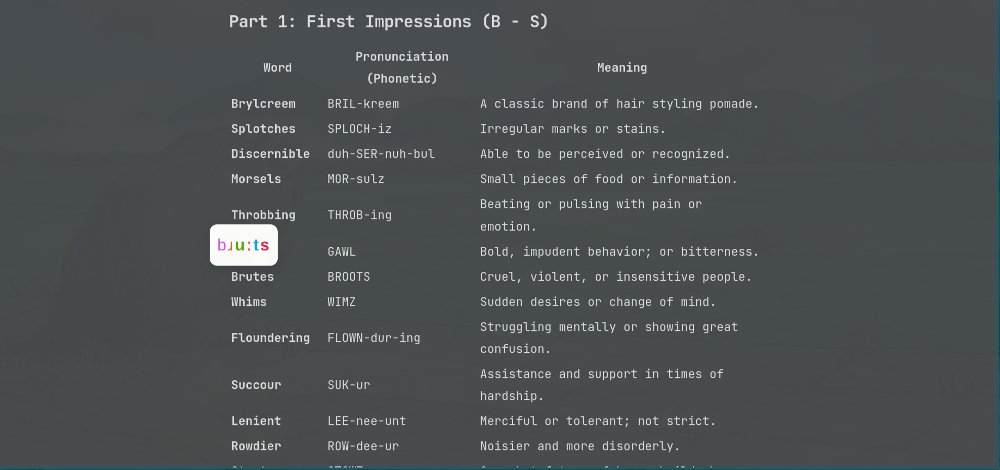

# Word Hover IPA

Hover over any word on a webpage to see its IPA (International Phonetic Alphabet) transcription in a colour-coded floating popup.



## Features

- Floating IPA popup appears above the hovered word
- Each phoneme is colour-coded; stressed syllables are bold
- Dark / Light / Auto theme
- Adjustable font size, letter spacing, padding, and vertical offset
- Load any custom dictionary via URL, local file path, or drag-and-drop

## Installation

### Firefox
1. Go to `about:addons` → gear icon → **Install Add-on From File**
2. Select `dist/word-hover-ipa-firefox.xpi`

### Chrome / Chromium
1. Go to `chrome://extensions` and enable **Developer mode**
2. Click **Load unpacked** and select the `chrome/` directory
   *(or unzip `dist/word-hover-ipa-chrome.zip` and load that folder)*
3. To support local `file://` dictionaries, click the extension's **Details** and enable **Allow access to file URLs**

## Loading a Dictionary

Open the extension popup and use any of three methods:

### URL
Paste an `https://` URL pointing to a plain-text dictionary and click **Load**.

### Local file path (Firefox)
1. Open the file in Firefox first — drag it to the address bar, or use **File → Open File**
2. Paste the same `file:///path/to/dict.txt` path in the popup and click **Load**

Firefox blocks extensions from opening local files programmatically; reading from an already-open tab is the only permitted route.

### Drag & Drop
Drag a `.txt` file from your file manager, or drag a URL from the address bar, directly onto the **drop zone** in the popup.

## Dictionary Format

Plain text, one entry per line, word and IPA separated by a tab:

```
hello	/həˈloʊ/
world	/wɜːld/
```

The `/ /` delimiters are optional. Lines without a tab are ignored.

## Building from Source

```bash
make firefox   # → dist/word-hover-ipa-firefox.xpi
make chrome    # → dist/word-hover-ipa-chrome.zip
make all       # both
make clean     # remove dist/
```

Requires `zip` in PATH.
